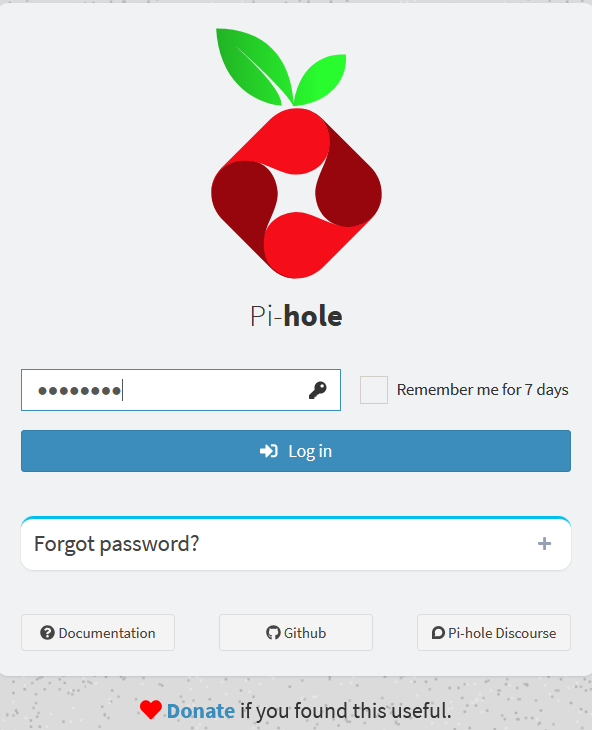
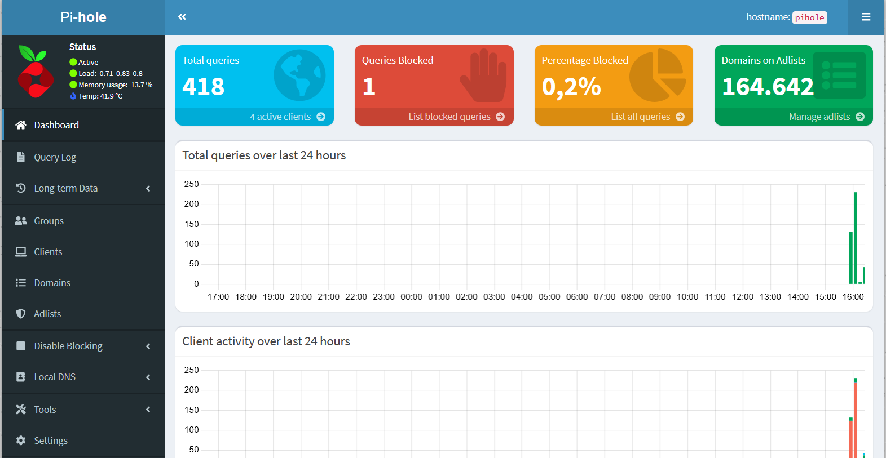

# pihole-arm32v7

Works both arm32v7 and aarch64.

Tested on Orange Pi 3B Ubuntu 24.04

## How to install?

Disable local dns service:
````
systemctl stop systemd-resolved

systemctl disable systemd-resolved
````

Update local dns on host:
````
cp /etc/resolv.conf /etc/resolv.conf.bkp

cat > /etc/resolv.conf
nameserver 8.8.8.8
nameserver 1.1.1.1
````
Clone this project:
````
cd /opt
git clone https://github.com/primoitt83/pihole-arm32v7.git
cd pihole-arm32v7
````
Change variables below:
````
vim docker-compose.yml

- FTLCONF_LOCAL_IPV4=myHomeserverIP
- WEBPASSWORD=myPassword
- REV_SERVER_CIDR=192.168.0.0/16 (change to your network)
- REV_SERVER_TARGET=myGateway (usually router's ip)

docker-compose up -d
````

Check logs:
````
docker-compose logs -f --tail=100

(...)
pihole  | Starting unbound
pihole  |   [✗] DNS resolution is currently unavailable
  [✓] DNS resolution is now available
(...)
pihole  |   [✓] FTL is listening on port 53
pihole  |      [✓] UDP (IPv4)
pihole  |      [✓] TCP (IPv4)
pihole  |      [✗] UDP (IPv6)
pihole  |      [✗] TCP (IPv6)
pihole  | 
pihole  |   [i] Pi-hole blocking will be enabled
pihole  |   [i] Enabling blocking
  [✓] Pi-hole Enabled
pihole  | 
pihole  |   Pi-hole version is v5.18.2 (Latest: v5.18.3)
pihole  |   web version is v5.21 (Latest: v5.21)
pihole  |   FTL version is v5.25.1 (Latest: v5.25.2)
pihole  |   Container tag is: 2024.03.2
````
Access pihole:

http://myHomeserverIP:8080


<br>
<br>


